<a href="https://github.com/mxioi">
  <picture>
    <source media="(prefers-color-scheme: dark)" srcset="assets/header-dark.svg">
    <source media="(prefers-color-scheme: light)" srcset="assets/header-light.svg">
    
  </picture>
</a>

## 👋 About Me

I'm a **Systems Administrator in the UK**. My day job is keeping Windows and Linux infrastructure healthy: the identities, devices, networks and servers people rely on without thinking about them. At home I run a homelab where I try new tools properly before trusting them anywhere else.

<table>
<tr>
<td width="50%" valign="top">

**🛠️ What I do**

- Manage users and devices with Active Directory, SCCM/MECM and Intune
- Build and secure networks with UniFi, pfSense and Cisco, including WPA3-Enterprise over RADIUS
- Self-host services on Proxmox and Docker, behind Nginx
- Automate repetitive admin work with PowerShell, Bash, Python and n8n

</td>
<td width="50%" valign="top">

**🧭 How I work**

- **Automate it.** If I've done a task twice, I script it.
- **Find the real cause.** Getting [Fusion 360 running on Linux](https://github.com/mxioi/fusion360-wine-linux) meant tracking down four separate root causes.
- **Write it down.** Clear guides so the next person can do it without me.
- **Keep learning.** Currently cloud infrastructure and DevOps.

</td>
</tr>
</table>

> [!TIP]
> 💼 **Open to Systems Administrator and Infrastructure roles in the UK.** Get in touch on [LinkedIn](https://www.linkedin.com/in/michael-vickers-7a30b3164/).

## 🚀 Featured Projects

<!-- PROJECTS:START -->
<!-- Generated from projects.toml by scripts/update_projects.py. Edit that file, not this section. -->

<table>
<tr>
<td width="50%" valign="top">

### 📚 [Local Mirror Library](https://github.com/mxioi/local-mirror-library)
**Self-hosted offline mirror for Wikipedia and RFC pages**

Full-stack app with FastAPI, job queue, AD/LDAP sign-in, admin panel, CI and Docker/Kubernetes deployment

   

</td>
<td width="50%" valign="top">

### 🎙️ [Orbit](https://github.com/mxioi/orbit)
**Hands-free desktop voice assistant with barge-in**

Real-time audio pipeline (VAD, Whisper STT, Piper TTS) with a CUDA → Vulkan → CPU fallback chain on Windows and Linux

   

</td>
</tr>
<tr>
<td width="50%" valign="top">

### 🔐 [WPA3-Enterprise with AD](https://github.com/mxioi/wpa3-enterprise-ad-guide)
**802.1X Wi-Fi using NPS/RADIUS, Active Directory and UniFi** · ⭐ 1

Enterprise network security end to end: AD CS certificates, NPS policies and UniFi configuration

  

</td>
<td width="50%" valign="top">

### 🛠️ [Fusion 360 on Linux](https://github.com/mxioi/fusion360-wine-linux)
**Run Autodesk Fusion 360 on Linux with Wine/Bottles** · ⭐ 4

Debugging four separate root causes (GPU, Wayland, OAuth, OOM) and packaging the fixes into a setup script

  

</td>
</tr>
<tr>
<td width="50%" valign="top">

### 🎬 [Plex Direct Access](https://github.com/mxioi/plex-direct-access)
**Plex streaming across multiple networks with DNS and NAT** · ⭐ 1

Practical network design using DNS and NAT forwarding to keep streams direct across networks

  

</td>
<td width="50%" valign="top">

### 🗄️ [Homelab Rack CAD Generator](https://github.com/mxioi/Homelab-Server-Rack-CAD-Generator)
**Generate rack layouts and CAD models from Python**

Infrastructure planning as code, with an interactive 3D viewer on GitHub Pages

 

</td>
</tr>
</table>

<b>📂 More projects</b>

 

| Project | Description | Tech |
|:--------|:------------|:-----|
| [SCCM Guide](https://github.com/mxioi/SCCM-Guide) | SCCM/MECM deployment guide |  |
| [AD User Lookup](https://github.com/mxioi/AD-User-lookup-tool) | Find when an Active Directory user last signed in |  |
| [OneDrive Remove](https://github.com/mxioi/onedrive-remove) | Cleanly remove OneDrive from Windows |  |
| [PowerShell Guide](https://github.com/mxioi/powershell-guide-for-beginners) | PowerShell cheat sheet from my own learning |  |
| [SSH Guide](https://github.com/mxioi/SSH-Guide) | SSH configuration guide |  |
| [MacBook Pro Zorin Setup](https://github.com/mxioi/macbookpro15-4-zorin-setup) | Linux on a MacBook Pro 15,4 |   |
| [MOV to MP4 Converter](https://github.com/mxioi/MOV-to-MP4-Converter) | Simple video converter |   |

<!-- PROJECTS:END -->

## ⚡ Tech Stack

<picture>
  <source media="(prefers-color-scheme: dark)" srcset="assets/stack-dark.svg">
  <source media="(prefers-color-scheme: light)" srcset="assets/stack-light.svg">
  
</picture>

## 📊 GitHub Activity

<picture>
  <source media="(prefers-color-scheme: dark)" srcset="assets/stats-dark.svg">
  <source media="(prefers-color-scheme: light)" srcset="assets/stats-light.svg">
  
</picture>
<picture>
  <source media="(prefers-color-scheme: dark)" srcset="assets/languages-dark.svg">
  <source media="(prefers-color-scheme: light)" srcset="assets/languages-light.svg">
  
</picture>

<picture>
  <source media="(prefers-color-scheme: dark)" srcset="https://raw.githubusercontent.com/mxioi/mxioi/output/github-contribution-grid-snake-dark.svg">
  <source media="(prefers-color-scheme: light)" srcset="https://raw.githubusercontent.com/mxioi/mxioi/output/github-contribution-grid-snake.svg">
  
</picture>

---

<i>Happy to talk about infrastructure, automation or homelabs. The best way to reach me is on <a href="https://www.linkedin.com/in/michael-vickers-7a30b3164/">LinkedIn</a>.</i>

